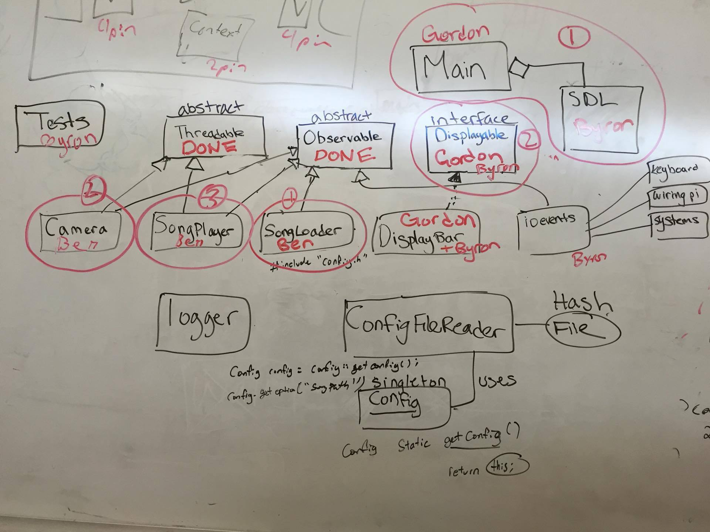

= Schulich Delta Onboard Media Control

This program is an onboard media control for the University of Calgary's Solar Car Team in Schulich Delta. The program features a backup camera and a music player on a raspberry pi.

It is currently WIP. Please select "Tags" and use the "2015gen4" if you want something that runs.

The current plan:

